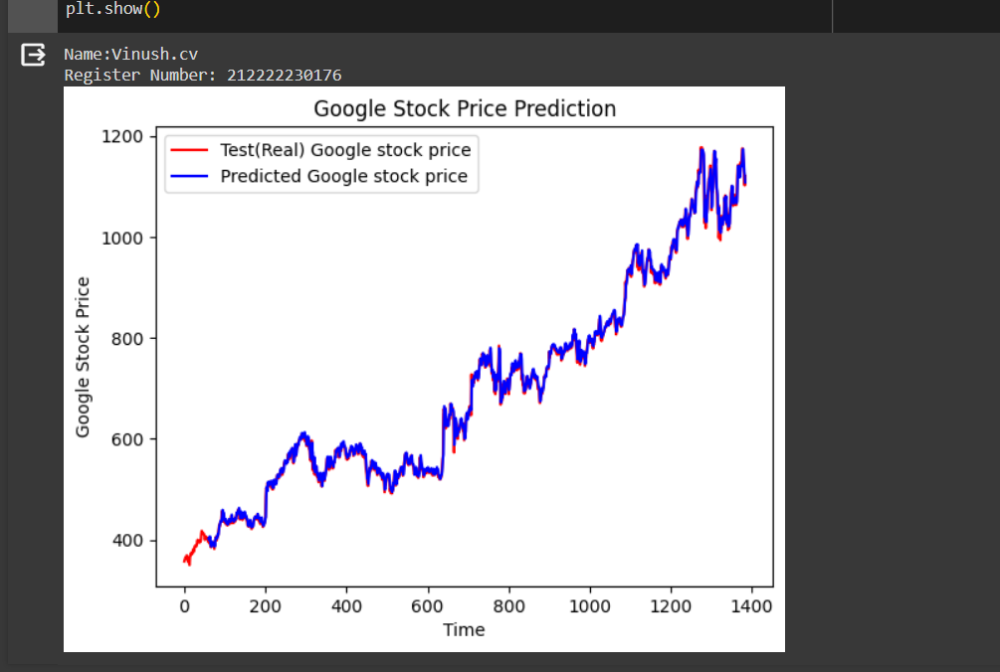
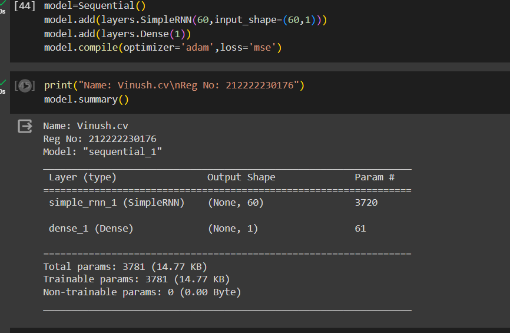
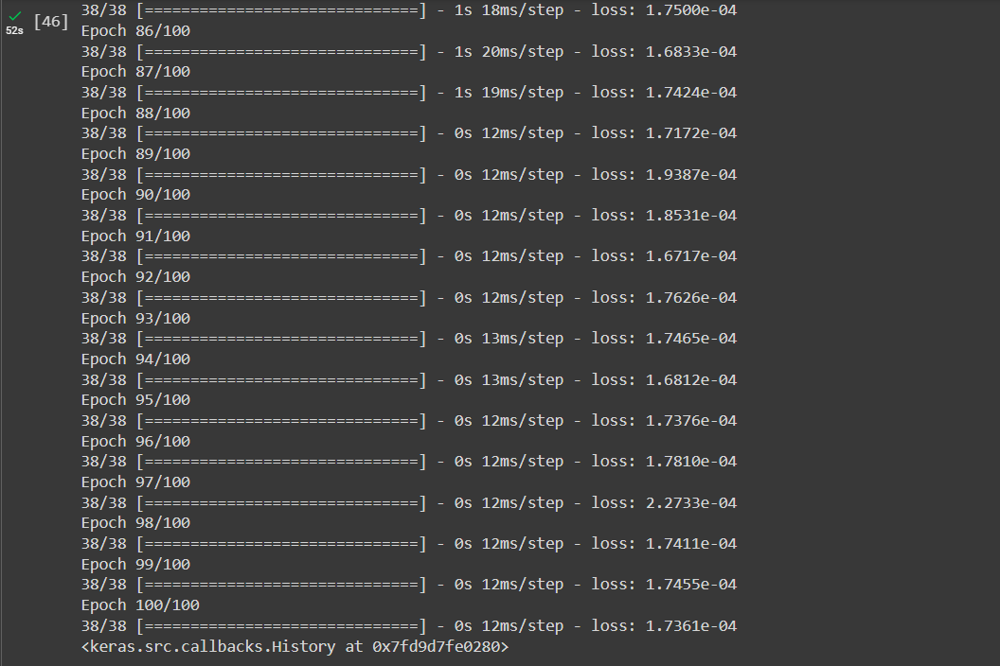

# Stock Price Prediction

## AIM

To develop a Recurrent Neural Network model for stock price prediction.

## Problem Statement and Dataset

Develop a Recurrent Neural Network (RNN) model to predict the stock prices of Google. The goal is to train the model using historical stock price data and then evaluate its performance on a separate test dataset.

Dataset: The dataset consists of two CSV files:

Trainset.csv: This file contains historical stock price data of Google, which will be used for training the RNN model. It includes features such as the opening price of the stock.
Testset.csv: This file contains additional historical stock price data of Google, which will be used for testing the trained RNN model. Similarly, it includes features such as the opening price of the stock.
The objective is to build a model that can effectively learn from the patterns in the training data to make accurate predictions on the test data.

## Design Steps

### Step 1: 

Read and preprocess training data, including scaling and sequence creation.

### Step 2:

Initialize a Sequential model and add SimpleRNN and Dense layers.

### Step 3: 

Compile the model with Adam optimizer and mean squared error loss.

### Step 4: 

Train the model on the prepared training data.

### Step 5: 

Preprocess test data, predict using the trained model, and visualize the results.


## Program
#### Name:Vinush.cv
#### Register Number:212222230176

```python
import numpy as np
import matplotlib.pyplot as plt
import pandas as pd
from sklearn.preprocessing import MinMaxScaler
from keras import layers
from keras.models import Sequential
from keras import models

dataset_train = pd.read_csv('trainset.csv')

dataset_train.head()

dataset_train.columns

dataset_train.tail()

train_set = dataset_train.iloc[:,1:2].values

train_set

type(train_set)

train_set.shape

sc = MinMaxScaler(feature_range=(0,1))
training_set_scaled = sc.fit_transform(train_set)

training_set_scaled.shape

X_train_array = []
y_train_array = []
for i in range(60, 1259):
  X_train_array.append(training_set_scaled[i-60:i,0])
  y_train_array.append(training_set_scaled[i,0])
X_train, y_train = np.array(X_train_array), np.array(y_train_array)


X_train1 = X_train.reshape((X_train.shape[0], X_train.shape[1],1))

X_train1.shape

X_train.shape

model=Sequential()
model.add(layers.SimpleRNN(60,input_shape=(60,1)))
model.add(layers.Dense(1))
model.compile(optimizer='adam',loss='mse')

print("Name: Vinush.cv\nReg No: 212222230176")
model.summary()

model.fit(X_train1,y_train,epochs=100, batch_size=32)


dataset_test = pd.read_csv('testset.csv')

test_set = dataset_test.iloc[:,1:2].values

test_set.shape

dataset_total = pd.concat((dataset_train['Open'],dataset_test['Open']),axis=0)

inputs = dataset_total.values
inputs = inputs.reshape(-1,1)
inputs_scaled=sc.transform(inputs)
X_test = []
for i in range(60,1384):
  X_test.append(inputs_scaled[i-60:i,0])
X_test = np.array(X_test)
X_test = np.reshape(X_test,(X_test.shape[0], X_test.shape[1],1))

X_test.shape

predicted_stock_price_scaled = model.predict(X_test)
predicted_stock_price = sc.inverse_transform(predicted_stock_price_scaled)

print("Name:Vinush.cv\nRegister Number: 212222230176    ")
plt.plot(np.arange(0,1384),inputs, color='red', label = 'Test(Real) Google stock price')
plt.plot(np.arange(60,1384),predicted_stock_price, color='blue', label = 'Predicted Google stock price')
plt.title('Google Stock Price Prediction')
plt.xlabel('Time')
plt.ylabel('Google Stock Price')
plt.legend()
plt.show()

```

## Output

### True Stock Price, Predicted Stock Price vs time



### Mean Square Error






## Result

Thus a Recurrent Neural Network model for stock price prediction is done.

